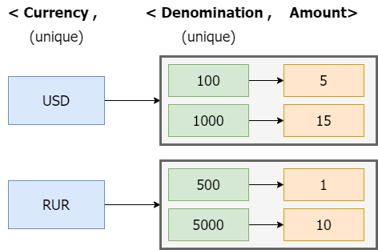
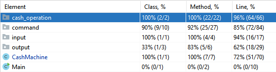

# Cash Machine Back End Developer Position Test Task

A friendly reminder: If this repo somehow helped you please **star** 🌟 it! Thank you! 😄

## Task

Is to create simple Cash Machine emulator.

_Requirements_ **(9/9 completed)**:
- [x] create stand-alone console I/O Java program using any JDK;
- [x] follow OOP paradigm;
- [x] make program easily extendable;
- [x] provide logging to the output file;
- [x] divide program modules into packages;
- [x] generate JavaDocs;
- [x] write JUnit tests for public methods;
- [x] make Ant `build.xml`;
- [x] make functional test.

Input commands:
1. **Cash deposit** 
```Bash
Format: + <currency> <denomination> <amount>
Validation: 
* <currency> 3 uppercase letters, any combination
* <value> any value in set ["1","5","10","50","100","500","1000","5000"]
* <number> positive integer
Reply: OK on success, ERROR on validation fail
```

2. **Cash withdraw**
```Bash
Format: - <currency> <amount>
Reply: line formatted as <denomination> <amount> followed by OK on success, ERROR if amount is unavailable
```

3. **Cash print**
```Bash
 Format: ?
 Reply: OK, ordered by currency -> value
```

# Run, build and test

### Build

```
Ant:
```Bash
ant build
```

### Test

```
Ant:
```Bash
ant test
```

### Run

```
Ant:
```Bash
ant run
```

# Solution

Before coding, we should make a plan:
1. How to handle commands;
2. Deposit/Withdraw strategy;
3. I/O common interface.

### Commands handling

To handle the command problem I decided to go for behavioral design **[Command pattern](https://en.wikipedia.org/wiki/Command_pattern)** which delegates command build to the command factory.

I recommend to check **[Jairo Alfaro's reply](https://stackoverflow.com/a/46968141)** on StackOverflow since he gives a good example of the implementation in C#. 

### Deposit/Withdraw strategy

I decided to arrange data in a structure `Map<String, TreeMap<Integer, Integer>>` since we basically have this kind of structure:



Since we have to pop up bigger banknotes first, we store `Map<Integer, Integer>` in a reverse order. In Java, `TreeMap<Integer, Integer>` stores keys in a natural order, so in our case we should apply `Collections.reverseOrder()` on initialization.

The rest of the algorithm is a piece of cake. For the deposit we simply add cash to the denomination, for the withdrawal we subtract the amount of remove the denomination if the amount is exact. Also, handle the situation when amount is unavailable (denomination absence, etc.).

### I/O common interface

I created an I/O interface (`InputReader` & `OutputWriter`) and implemented corresponding reader and writer to work with streams. These classes can work both with `System.in`/`System.out` and `FileInputStream`/`FileOutputStream` so we can easily switch between file and console I/O.

# Test coverage

